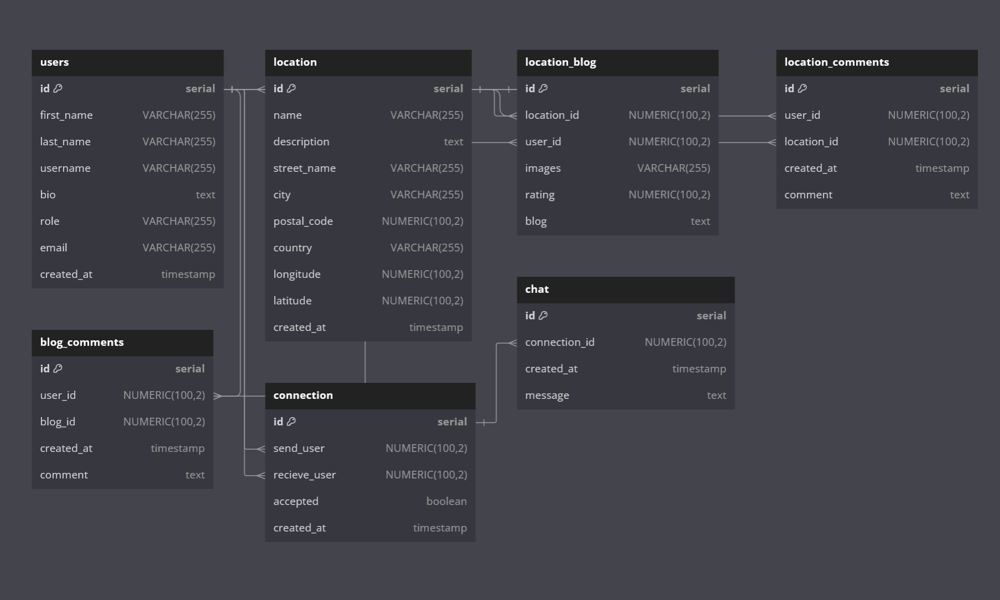

# Entity Relationship Diagram

Reference the Creating an Entity Relationship Diagram final project guide in the course portal for more information about how to complete this deliverable.

```
// Use DBML to define your database structure
// Docs: https://dbml.dbdiagram.io/docs

Table user {
  id serial [primary key]
  first_name VARCHAR(255)
  last_name VARCHAR(255)
  username VARCHAR(255)
  bio text
  role VARCHAR(255)
  email VARCHAR(255)
  created_at timestamp
}

Table location {
  id serial [primary key]
  name VARCHAR(255)
  description text
  street_name VARCHAR(255)
  city VARCHAR(255)
  postal_code NUMERIC(100, 2)
  country VARCHAR(255)
  longitude NUMERIC(100, 2)  
  latitude NUMERIC(100, 2) 
  created_at timestamp
}

Table location_blog {
  id serial [primary key]
  location_id NUMERIC(100, 2)  
  user_id NUMERIC(100, 2)
  images VARCHAR(255)
  rating NUMERIC(100, 2)
  blog text
}


Table location_comments {
  id serial [primary key]
  user_id NUMERIC(100, 2)
  location_id NUMERIC(100, 2)
  created_at timestamp
  comment text
}


Table blog_comments {
  id serial [primary key]
  user_id NUMERIC(100, 2)
  blog_id NUMERIC(100, 2)
  created_at timestamp
  comment text
}

Table connection {
  id serial [primary key]
  send_user NUMERIC(100, 2)
  recieve_user NUMERIC(100, 2)
  accepted boolean
  created_at timestamp
}

Table chat {
  id serial [primary key]
  connection_id NUMERIC(100, 2)
  created_at timestamp
  message text
}


Ref: users.id < location.id
Ref: location.id < location_blog.location_id
Ref: location.id < location_comments.location_id
Ref: users.id < location_blog.user_id
Ref: users.id < location_comments.user_id
Ref: users.id < blog_comments.user_id
Ref: location_blog.id < blog_comments.user_id

Ref: users.id < connection.send_user
Ref: users.id < connection.recieve_user

Ref: connection.id < chat.connection_id 

```

## Create the List of Tables

Table List:
  
  user
  
  location
  
  location_blog
  
  location_comments
  
  blog_comments
  
  connection
  
  chat
  

## Add the Entity Relationship Diagram


