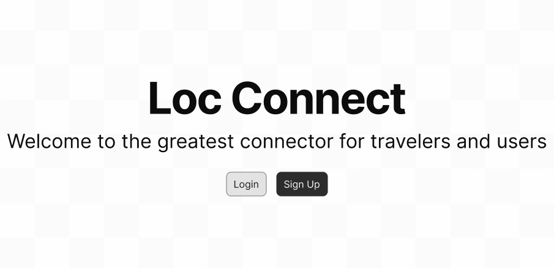
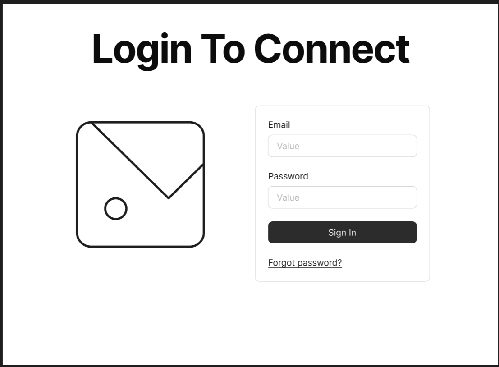
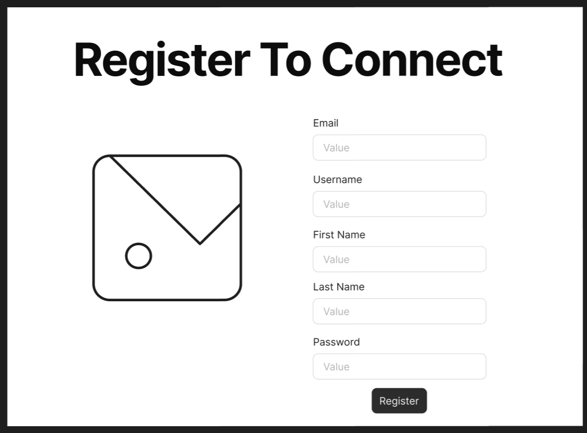
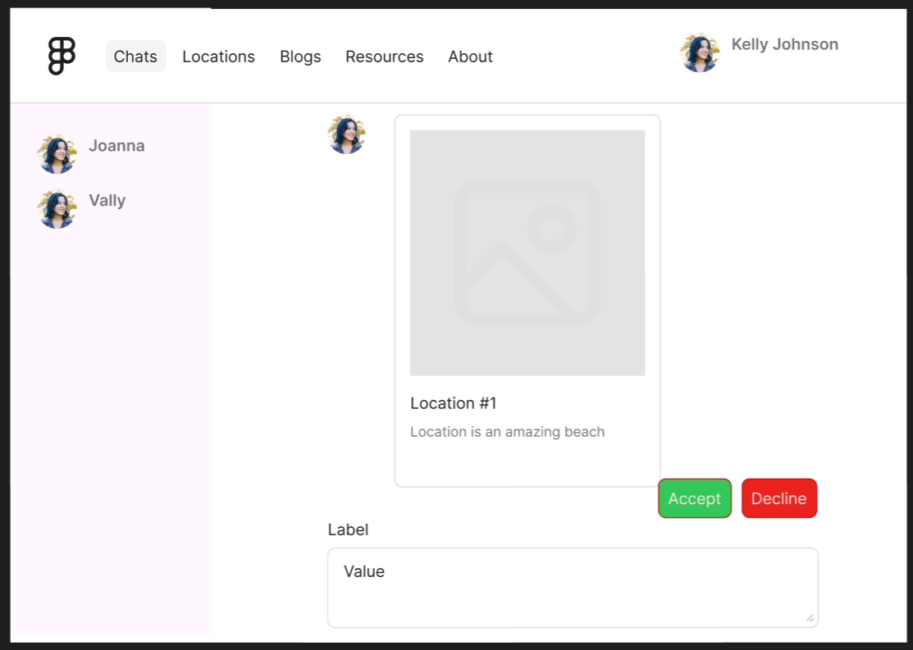
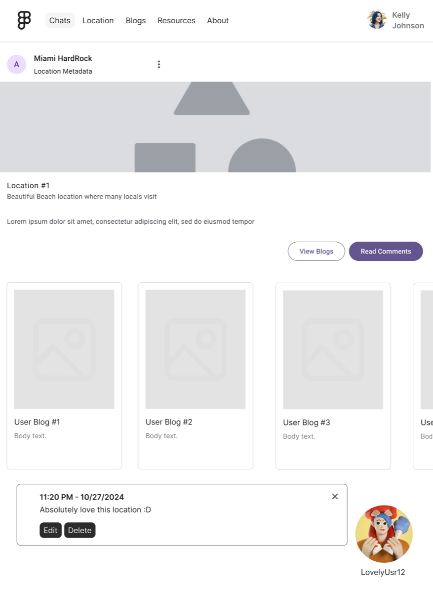
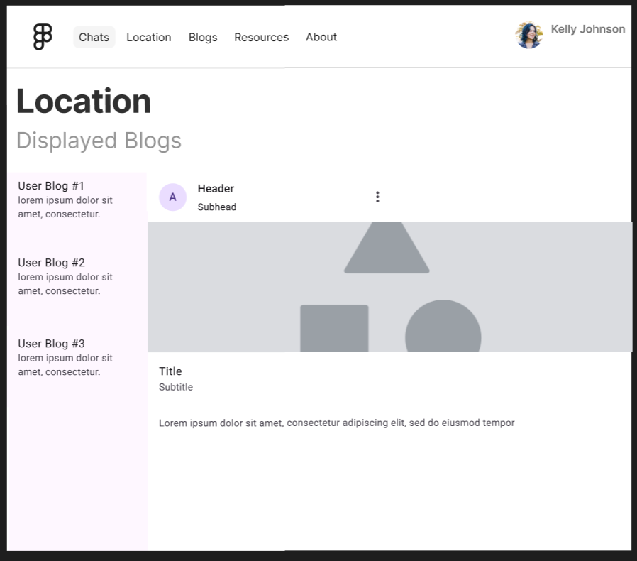
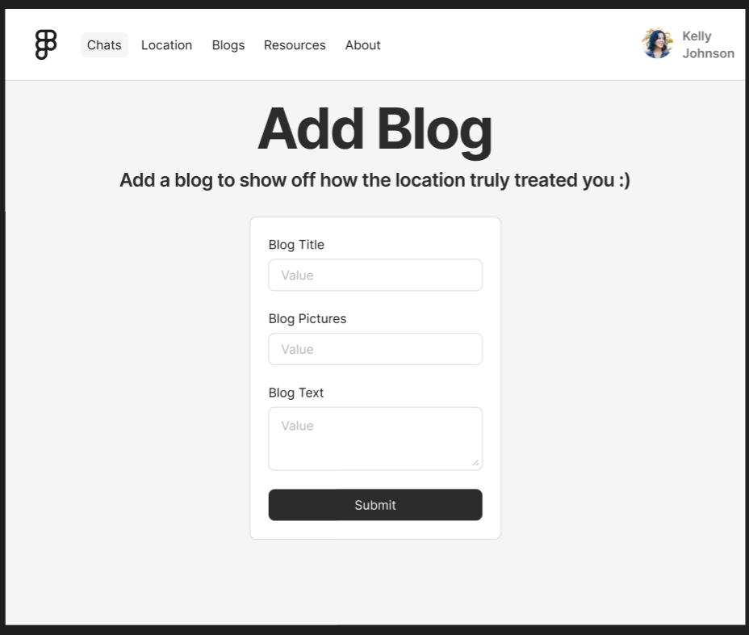
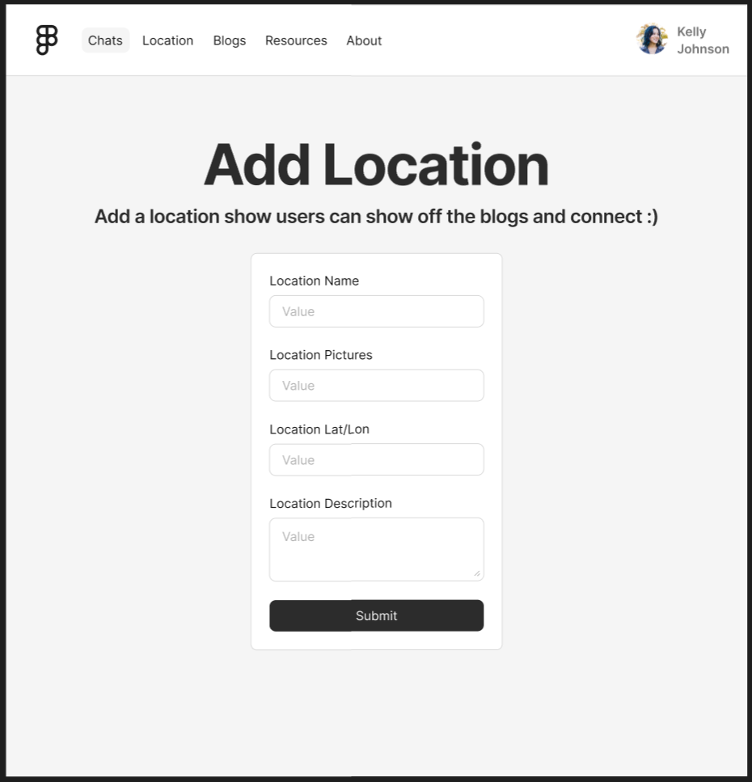

# [Wireframe](https://www.figma.com/design/RZkgPe9vOYNEO23VvYtGCd/Location-Chat?t=koUmWd7Q3VRz6Xwd-1)

Reference the Creating an Entity Relationship Diagram final project guide in the course portal for more information about how to complete this deliverable.

## List of Pages

### Hero 
### Login
### Sign Up
### Chat 
### Location
### Location Blog
### Add Location
### Add Location Blog

# Wireframe Pages

## Wireframe 1: Hero Page

## Wireframe 2: Login

## Wireframe 3: Sign Up

## Wireframe 4: Chat

## Wireframe 5: Location

## Wireframe 6: Location Blog

## Wireframe 7: Add/Edit Location

## Wireframe 8: Add/Edit Location Blog

